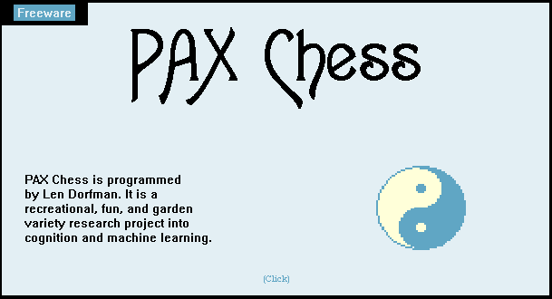

# PAX Chess, 2001 → 2026

**Play it:** https://mf4633.github.io/pax-chess/

A tribute to **Len Dorfman** (Leonard Dorfman, PhD), who taught programming in the Shoreham-Wading River schools from 1970 to 1999, wrote *Developing Games That Learn* (1996, with Narendra Ghosh), and released **PAX Chess** as "Forever Freeware": *"a recreational, fun, and garden variety research project into cognition and machine learning."*

> He first got me interested in the internet in 1995 and 1996. He did tai chi on the soccer field in the mornings and didn't care what people thought of him. In a chaotic middle school, his classroom was a bastion of peace.
>
> — a former student

On his homepage he called himself "a middle-age teacher, writer, programmer, devoted husband, father and alpha-dog wanna-be," practiced Yang Style Taijiquan and Vipassana meditation every day, and kept two quotes:

> "Kindness is my religion." (the Dalai Lama, his favorite)
>
> "You don't have to be a Buddha to act like one." (the one he used to guide his behavior)

He started PAX in 1996 as a 16-bit DOS text-mode program "for laughs," and it grew into what he called "a quirky 32-bit multithreaded perpetual work-in-progress." His archived homepage: https://web.archive.org/web/20021124200729/http://lendorfman.freeservers.com/

PAX had a menu item for machine learning. Its switch said *"The feature will be coded after PAX starts learning."* PAX 2.0 is that feature.

## What is his, unchanged

Everything below comes from the PAX 2001 release (`PAX.EXE`, build 11.17.01, and `MARK10.DAT`) as preserved on the Internet Archive's copy of his site, `lendorfman.freeservers.com`.

- **His opening book.** `mark10w.txt` is his 13 MB `MARK10.DAT` byte for byte. Control bytes are written as `~XX` so the file can be served as text. PAX 2.0 plays straight from it while it can.
- **His art.** The title screen with its pixel yin-yang, the hand-drawn pieces and teal board, and the lotus emblem (a lamp inside five petals: Truth, Right Conduct, Peace, Love, Non-Violence) were cut from the bitmaps inside `PAX.EXE`. `art/pieces.png` is a sprite of bitmaps 130–157. The page draws everything at whole-number scale only (40 px or 80 px squares), so his pixels stay square.
- **His words.** The temperaments Aggressive, Satvic and Passive; the difficulty names; "Forever Freeware"; "PAX feels utter dispair and resigns. Well Done!"; and his sign-off on a request for move lists: *with metta, Len*.
- **His rule.** From *Developing Games That Learn*: a forced move can't be the mistake, so blame passes back to the move before it.

## What is new

- **Judgement.** Middlegame and endgame piece-square tables, fitted by gradient descent (Texel-style tuning) to Stockfish's scores on about 900,000 positions from games that start in his book. A small NNUE-style network was tried first. It was no more accurate and searched ten times slower, so the tables won.
- **Learning from losses.** After a loss, PAX replays the game and finds the *point of no return*, the last moment its winning chances were above 35%. The PAX move right after it becomes a lesson. Each lesson nudges the tables so similar positions are judged differently too, and is also kept as a never-enter position, his 1996 rule. Lessons live in your browser's local storage and are replayed every time the page opens.
- **Strength.** In testing against Stockfish at limited strength, PAX 2.0 rated about 1550 and the original PAX about 1560, the same within the margin of error.

PAX 2.0 is a tribute, not his code. The engine, page and tools here were written new.

## Files

| Path | What |
|---|---|
| `index.html` | The page. Static, with no build step. Loads chess.js 0.10.3 from cdnjs. |
| `engine.js` | Search and evaluation. Runs as a Web Worker and also loads in Node. |
| `tables.json` | The tuned piece-square tables. |
| `mark10w.txt` | Dorfman's opening book (see above). |
| `art/` | Bitmaps from `PAX.EXE`, converted to PNG with no other change. |
| `tools/gen.py` | Builds Stockfish-labelled training positions from games that start in his book. Needs `python-chess` and Stockfish (`PAX_STOCKFISH=/path/to/stockfish`). |
| `tools/train.py`, `tools/tune.py` | The network experiment, and the Texel tuning that produced `tables.json` (PyTorch). |
| `tools/match_sf.js` | Plays the engine against Stockfish at a set Elo. `npm i chess.js@0.10.3`, then `node tools/match_sf.js tables.json 1700 24 500`. |

To run locally, serve the folder (for example `python -m http.server`) and open `http://localhost:8000/`. Opening `index.html` straight from disk won't work, because browsers block Web Workers and `fetch` on `file://`.

## Rights

PAX Chess, its opening book, its artwork and its text are Len Dorfman's work. He gave them away as freeware, and they are included here unchanged as a tribute. If you are a member of his family and want anything changed or removed, please open an issue and it will be done.

The new code in this repository (`index.html`, `engine.js`, `tables.json` and `tools/`) is under the MIT License; see `LICENSE`.
